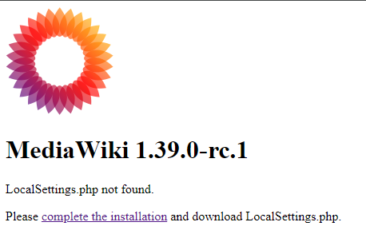

# MediaWiki1.39-Apache-php8.0

This was a small project for a friend a while ago, they suggested I post it on GitHub...
 
I have not figured out how to create the "LocalSettings.php" file in an automated way and have it work 100% of the time. That means that you have to do a little work to get it up and running. 
 
 
I could always use the help. So, please…without hesitation, give me feedback.  More important, give me the best practice. I have no qualms with people showing and telling me how to better my limited knowledge.
 
 
Quote by Ram Dass: (or << Backtrack)  
“The quieter you become, the more you can hear.”

## Dependencies

<b>Using Red Hat DISA-STIG security profile</b>

Keep in mind of Internal and External DNS and rules on your routers\firewalls, assuming you want this to be public.
Also note that the versions may be different, based on when you install
* MediaWiki 1.39
* Red Hat Enterprise Linux 8.7 (Ootpa)
* Apache/2.4.37 (Red Hat Enterprise Linux)
* certbot 1.22.0
* Ver 15.1 Distrib 10.3.35-MariaDB

## Installing\Executing 

What I like to do for this is log in as root or sudo -i.  then copy the script into the /tmp/ and then kick it off.
The first part of the script is for variables. 
A few things to consider first:

### SERVER STUFF
This is basically going to be your external DNS name for your website.  Its what you will enter into the URL
 
<b>SERVERNAME=mwiki.Your.Domain</b>

### CERT STUFF
The last line on the Script enables CertBot to create the SSL cert for the site. It is commented out, so make sure you have the External DNS setup properly and your firewall rules setup.  CertBot also needs port 80 and 443.  Please be careful how you setup your firewalls\NAT\Port forwarding

Email for Certbot that will notify when the Cert is expiring. Doesn't have to be real, but recommend
 
<b>CERTMAIL=your @ email.com</b>
 
### DB STUFF
This is the name of the database that will create for nextcloud
 
<b>DBNAME=mediawiki</b>

This is the username that is needed for the MediaWiki database.
 
<b>USER=wiki_user</b>

Email for MediaWiki Admin account 
Doesn't have to be real, but recommend
 
<b>APPMAIL=your @ email.com</b>

### PASSWORD STUFF
This generates a random password for the root account of mariadb. You can change it if you wish
* date +%s | sha256sum | base64 | head -c 16 > /tmp/.MARIADBPASSWORD

This generates a random password for the MediaWiki user account in mariadb. You can change it if you wish
* date +%s | sha256sum | base64 | head -c 16 >> /tmp/.APPPASSWORD

### EXTRA
Sometimes you don't want anyone to see\login\edit your wiki.  This setting will keep your wiki closed.
 
In <b>/var/www/html/mediawiki/LocalSettings.php</b>
 
 
Add this line to the end of the file
 
<b>wgGroupPermissions['*']['read'] = false;</b>
 

### CLEANING UP
When the script is done running it will remind you that there are passwords and scripts in the /tmp. Keep them there as long as you need them, but do remember to clean house.  If a bad actor popped into you machine, they would have the key to your kingdom.

## Final Installation
When the script is done running, you will see in the terminal the information to finish the installation. 
When you goto <b>https://ip</b> you should see something like this: 

  

 
Just go ahead and click the link <b>Complete the installation</b> and follow the instructions
 
Eventually you will get to the part when it asks you for Database info, this info will be in the terminal and\or /tmp/ directory
 

  

 
 
Continue with the process and eventually you will get here:
 
 

  

 
 
Now you have to download the <b>"LocalSettings.php"</b> and upload it to <b>/var/www/html/mediawiki</b>
 
Then click <b>enter your wiki</b>
 
That should be all.
